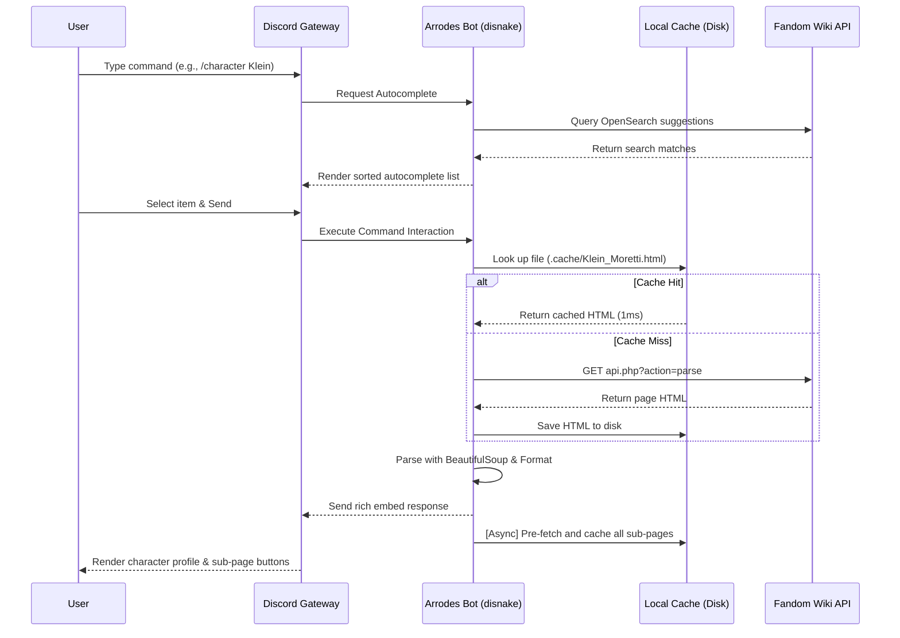

# 🔮 Arrodes

[](https://discord.com/oauth2/authorize?client_id=1189633573611913328)
[-success?logo=skynet&logoColor=white)](https://discord.com/oauth2/authorize?client_id=1189633573611913328)
[](https://opensource.org/licenses/MIT)

**Arrodes** is an advanced, high-performance Discord bot dedicated to the *Lord of the Mysteries* universe. Built on top of the modern `disnake` library, Arrodes features real-time Fandom Wiki scraping, persistent caching, interactive button navigation, and fast search autocompletion.

---

## 🚀 Key Features

* **👤 Rich Character Profiles (`/character`)**: Retrieve detailed profiles for any character, split into categories:
  * `summary` — Aliases, titles, pathways, birth, and gender.
  * `profile` — Residence, height, eye/hair appearance, occupations, and origin.
  * `mysticism` — Honorific names, authorities, and mystical symbols.
  * `relations` — Allies, enemies, relatives, and affiliations.
* **🔮 Interactive Sub-pages Navigation**: Dynamic Discord buttons appear below character profiles, allowing users to navigate directly to sub-sections (like `/History`, `/Abilities`, or `/Quotes`) in real-time.
* **📖 Universal Wiki Lookup (`/wiki`)**: Search and parse any page from the Fandom Wiki. It dynamically extracts portable infobox data fields, page images, and clean overview text.
* **⚡ Live Autocomplete Suggestions**: Dynamic search suggestions on slash commands powered by MediaWiki's OpenSearch API with custom relevance sorting.
* **💾 Persistent Cache Layer**: Locally caches scraped HTML files hierarchically to reduce API request latencies and bypass Cloudflare blocks.

---

## 🛠️ Commands List

| Command | Option | Description |
| :--- | :--- | :--- |
| `/character` | `<character_name>` `[category]` | Displays formatted embeds for a character based on category selection. |
| `/pathway` | `<pathway_name>` | Returns details about a Beyonder Pathway, including its Sequence levels. |
| `/artifact` | `<artifact_name>` | Displays Sealed Artifact classifications, corresponding pathways, abilities, and downsides. |
| `/wiki` | `<page_title>` | Searches and parses any general wiki page from Fandom. |

---

## 📐 Architecture & Caching Flow

Arrodes offloads blocking I/O requests and leverages a hierarchical disk-caching layer to serve pages in **1-2 milliseconds** on cache hits:



---

## 📦 Deployment & VPS Setup

### Quick One-Shot Script (Recommended)
Deploy and configure Arrodes on a fresh Ubuntu/Debian/Rocky Linux VPS with a single command:
```bash
bash <(curl -fsSL https://raw.githubusercontent.com/Theroid00/Arrodes/main/setup.sh)
```
This script handles package updates, installs Docker & Docker Compose, clones the repo, prompts you for your `BOT_TOKEN`, builds the image, and launches the container in detached mode.

### Manual Installation
1. **Clone the repository:**
   ```bash
   git clone https://github.com/Theroid00/Arrodes.git
   cd Arrodes
   ```
2. **Setup environment variables:**
   Create a `.env` file in the root directory:
   ```env
   BOT_TOKEN=your_discord_bot_token
   ```
3. **Build and start the bot:**
   ```bash
   docker-compose up --build -d
   ```

---

## 📊 Requirements
* Python 3.10+
* `disnake>=2.0`
* `beautifulsoup4>=4.11`
* `requests>=2.26`
* `aiohttp>=3.8`
* `python-dotenv>=0.19`
