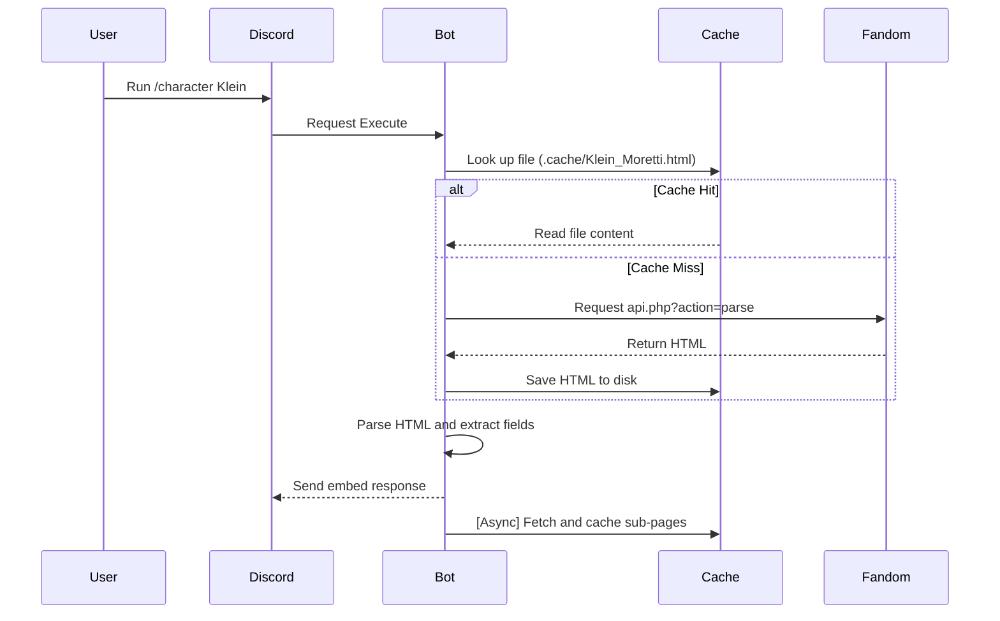

# Arrodes

[](https://discord.com/oauth2/authorize?client_id=1189633573611913328)
[-success?logo=skynet&logoColor=white)](https://discord.com/oauth2/authorize?client_id=1189633573611913328)

Arrodes is a Discord bot for the Lord of the Mysteries Fandom Wiki. It retrieves and displays character, pathway, and artifact information.

---

## Features

* **Wiki Scraping**: Queries Fandom's MediaWiki API to parse and display wiki pages.
* **Interactive Navigation Buttons**: Adds button components under character embeds to switch between Overview, History, Abilities, and Quotes sub-pages.
* **Command Autocomplete**: Displays live search suggestions as you type slash commands.
* **Disk Caching**: Caches scraped HTML pages in a local folder to avoid repeating network requests.
* **Universal Search**: General `/wiki` command to query any article on the wiki and display its infobox key-value data.

---

## Commands

| Command | Option | Description |
| :--- | :--- | :--- |
| `/character` | `<character_name>` `[category]` | Displays character profile details (Summary, Profile, Mysticism, Relations). |
| `/pathway` | `<pathway_name>` | Displays pathway details and Sequence levels. |
| `/artifact` | `<artifact_name>` | Displays Sealed Artifact classification, powers, and side effects. |
| `/wiki` | `<page_title>` | Displays general wiki page infobox values and summary. |

---

## Caching Flow



---

## Deployment & VPS Setup

### Shell Script (One-Shot)
Run this command on a fresh Ubuntu/Debian VPS to install Docker, clone the repository, and start the bot:
```bash
bash <(curl -fsSL https://raw.githubusercontent.com/Theroid00/Arrodes/main/setup.sh)
```

### Manual Installation
1. **Clone the repository:**
   ```bash
   git clone https://github.com/Theroid00/Arrodes.git
   cd Arrodes
   ```
2. **Setup environment variables:**
   Create a `.env` file in the root directory:
   ```env
   BOT_TOKEN=your_discord_bot_token
   ```
3. **Run with Docker Compose:**
   ```bash
   docker-compose up --build -d
   ```

---

## Requirements
* Python 3.10+
* `disnake>=2.0`
* `beautifulsoup4>=4.11`
* `requests>=2.26`
* `aiohttp>=3.8`
* `python-dotenv>=0.19`
